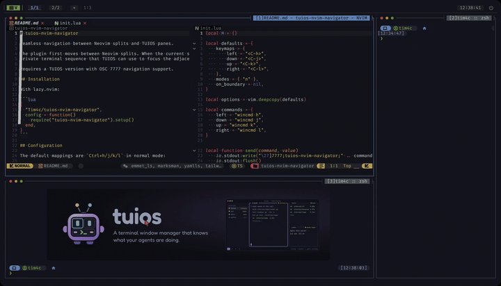

# tuios-nvim-navigator

Seamless navigation between Neovim splits and TUIOS panes.

The plugin first moves between Neovim splits. When the current split is at an edge, it emits a
private terminal sequence that TUIOS can use to focus the adjacent TUIOS pane.

Requires TUIOS with Neovim pane navigation support
([PR](https://github.com/Gaurav-Gosain/tuios/pull/318)).

[](assets/demo-sdr.mp4)

## Installation

With lazy.nvim:

```lua
{
  "Tim4c/tuios-nvim-navigator",
  config = function()
    require("tuios-nvim-navigator").setup()
  end,
}
```

## Configuration

The default mappings are `Alt+Left/Down/Up/Right` in normal mode, matching TUIOS's default terminal
focus mappings. If you customize either project, keep the four directions aligned.

```lua
require("tuios-nvim-navigator").setup({
  keymaps = {
    left = "<A-Left>",
    down = "<A-Down>",
    up = "<A-Up>",
    right = "<A-Right>",
  },
})
```
